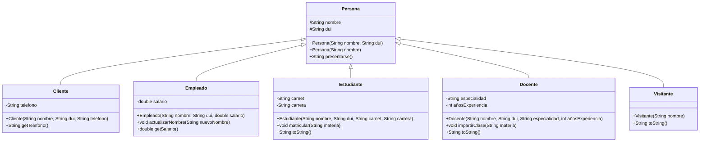

```mermaid
classDiagram

class Persona {
    #String nombre
    #String dui
    +Persona(String nombre, String dui)
    +Persona(String nombre)
    +String presentarse()
}

class Cliente {
    -String telefono
    +Cliente(String nombre, String dui, String telefono)
    +String getTelefono()
}

class Empleado {
    -double salario
    +Empleado(String nombre, String dui, double salario)
    +void actualizarNombre(String nuevoNombre)
    +double getSalario()
}

class Estudiante {
    -String carnet
    -String carrera
    +Estudiante(String nombre, String dui, String carnet, String carrera)
    +void matricular(String materia)
    +String toString()
}

class Docente {
    -String especialidad
    -int añosExperiencia
    +Docente(String nombre, String dui, String especialidad, int añosExperiencia)
    +void impartirClase(String materia)
    +String toString()
}

class Visitante {
    +Visitante(String nombre)
    +String toString()
}

Persona <|-- Cliente
Persona <|-- Empleado
Persona <|-- Estudiante
Persona <|-- Docente
Persona <|-- Visitante
```